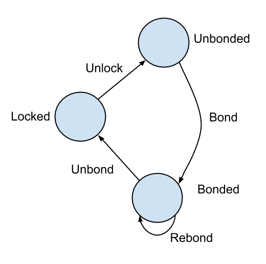

### Fetch.ai v2.0 Staking Contract

This contract will run on the Ethereum blockchain and is a replacement for the staking auction contract that operated between the middle of 2019 to August 2020. The goals of the contract are to:

- To simplify the staking process and reduce the effort that is required by both Fetch.ai and stakers.
- To lower costs. 
- To facilitate participation in incentivized test-nets.  

The logic of the smart contract is that users can bond or stake FET ERC-20 tokens at at any time, and are rewarded with a fixed interest rate for doing so. The staked tokens can be unbonded and after a fixed number of blocks are unlocked for transfers. The logic of the contract is shown in Figure 1, which shows a state diagram for FET tokens held in the staking contract. 

**Figure 1:** State diagram for the staking contract. Fet ERC-20 tokens are in the “Unbonded” stake and can be transferred freely. The other states cannot be transferred freely. 

A brief description of the public interface of the contract is given below: 

#### Public Functions

**addTokens:** Transfer ERC20 tokens to contract so that they are in the unbonded state. 

**bindStake:** Tokens are moved to the “Bonded” state. The block number is recorded to enable interest payments to be made. 

**unbindStake:** FET tokens are moved from the "Bonded" state to the "Locked" state. 

**withdraw:** Remove tokens from "unlocked" state to user's address. 

#### Contract Owner / Delegator functions

**changeInterestRate:** Change interest rate from the current block onwards. 

**updateLockPeriod:** Change lock-up period for subsequent unbondings. 

**withdrawRewards:** Owner can withdraw rewards from the contract. 

**addRewards:** Contract rewards can be added by external party. 

**unbondAll:** return all tokens in the bondedstate to the unlocked state. 
